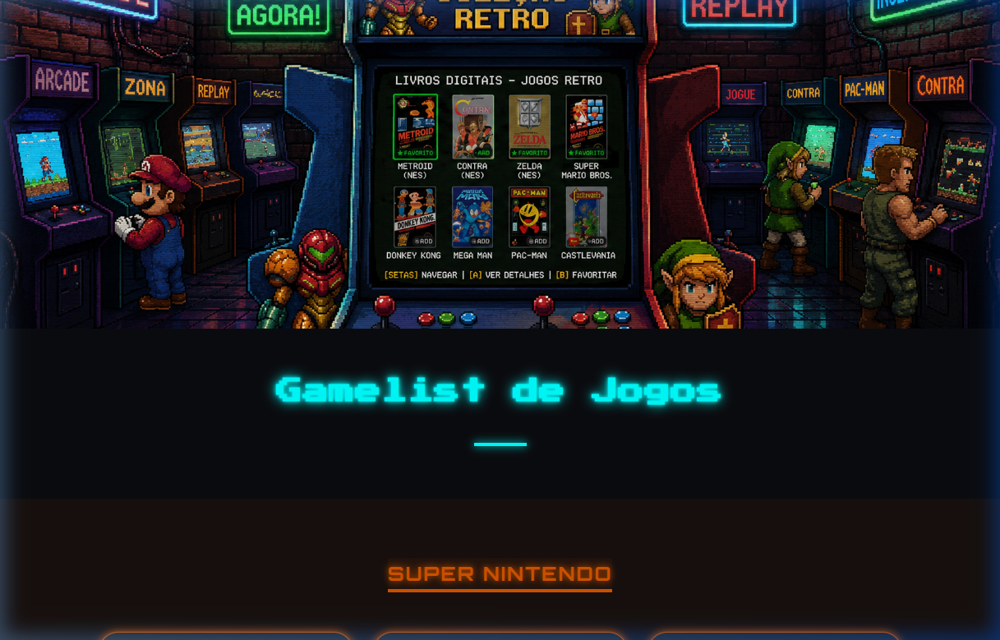
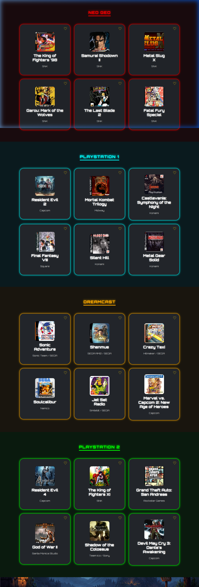

<div align="center">

# 🕹️ C O L E Ç Ã O   R E T R O 🕹️
**[ ORGANIZADOR DE JOGOS ]**

<br>
<p><i>>> P R E S S   S T A R T   T O   P L A Y <<</i></p>

---

</div>

```text
🎮 [ B O O T _ S E Q U E N C E ]
> INICIANDO_SISTEMA.................... [OK]
> CARREGANDO_MODULOS_ANGULAR.......... [OK]
> VERIFICANDO_SIGNALS................. [OK]
> ATIVANDO_CONTROL_FLOW............... [OK]
> MODO_RETRO_8BIT_ATIVADO............. [OK]
> SISTEMA_PRONTO.
```

<br>

## 📸 [ S C R E E N S H O T S ]




<br>

## 👾 [ M I S S Ã O _ D O _ P R O J E T O ]

A **Coleção Retro** é uma aplicação web desenvolvida em **Angular 19** durante um curso focado em:
- Estruturação de componentes com Signals.
- Novo fluxo de controle nativo (Control Flow).
- Reatividade moderna.

Originalmente era um organizador de livros, mas foi personalizado para ser um organizador de jogos com inspiração em:
- 🎮 Arcades e Fliperamas
- 🕹️ Consoles clássicos
- 💾 Estética Neon + Dark Mode

<br>

## 🧩 [ E N G I N E _ D O _ S I S T E M A ]

```text
╔══════════════════════════════════╗
║        CORE TECHNOLOGIES         ║
╚══════════════════════════════════╝
```

| ⚡ CAMADA | 🎯 TECNOLOGIA |
| :--- | :--- |
| 👨‍💻 Framework | Angular 19 |
| 🔄 Reatividade | Signals |
| 🔀 Fluxo | Control Flow (`@for`, `@if`) |
| 🎨 Estilo | Vanilla CSS (Neon UI) |

<br>

## 📊 [ S T A T U S _ D O _ S I S T E M A ]

```text
🎮 [ V E R S I O N _ C H E C K ]
> ANGULAR....................... [21.2.0]
> RXJS.......................... [7.8.0]
> TYPESCRIPT.................... [5.9.3] (Disponível: 6.0.3)
> JSDOM......................... [28.1.0] (Disponível: 29.1.1)
> PRETTIER...................... [2.8.8] (Disponível: 3.8.3)

💾 [ S A V E _ S T A T E ]
> BRANCH........................ [main] (Sincronizada)
> STATUS........................ [Modificado] (Refatoração de Livros para Jogos)
```

<br>

## 🚀 [ P O W E R _ U P S ]

*   **🎮 Agrupamento por Console**: Seus jogos divididos por Super Nintendo, Neo Geo, PS1, etc.
*   **❤️ Sistema de Favoritos**: Marque os jogos que você mais zerou.
*   **✨ Design Neon Premium**: Interface escura com brilho neon e fontes `Orbitron` e `Press Start 2P`.
*   **🖥️ Layout em Grade**: Nada de lista empilhada feia! Cards organizados lado a lado.
*   **👾 Tela de Zero Jogos**: Se você deletar todos os jogos de uma categoria no mock, uma imagem estilizada avisa que não há jogos cadastrados!

<br>

## 📦 [ I N S T A L A Ç Ã O ]

**🎯 1. Clone o cartucho (Repositório)**
```bash
$ git clone https://github.com/seu-usuario/seu-repositorio.git
```

**🎯 2. Entre na pasta**
```bash
$ cd organo
```

**🎯 3. Carregar save (Instalar dependências)**
```bash
$ npm install
```

**🎯 4. Ligar o console (Iniciar servidor)**
```bash
$ ng serve
```

**🎯 5. Abra no navegador**  
🔗 [http://localhost:4200](http://localhost:4200)

<br>

<div align="center">

```text
█▀▀ ▄▀█ █▀▄▀█ █▀▀   █▀█ █░█ █▀▀ █▀█
█▄█ █▀█ █░▀░█ ██▄   █▄█ ▀▄▀ ██▄ █▀▄
```
<p><b>>> GAME OVER? NEGATIVO.</b></p>
<p><b>>> NEXT LEVEL UNLOCKED...</b></p>

</div>
